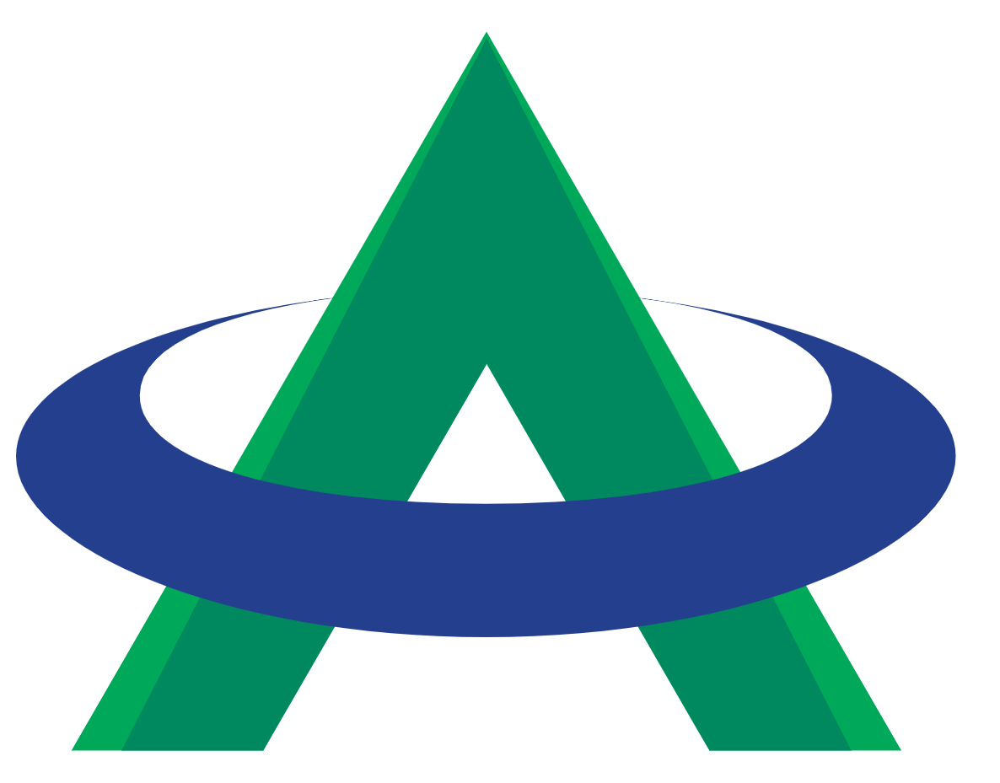
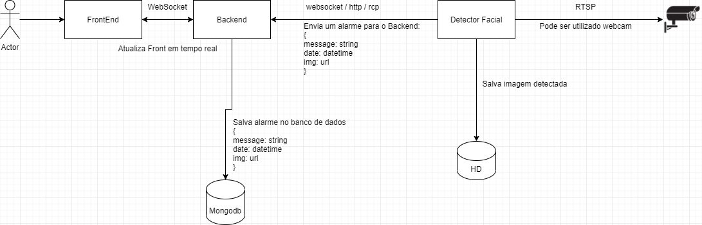

    

<h1 align='center'>Aton Engenharia</h1>

---

O sistema deve ser capaz de identificar presença facial em um feed de imagem, enviar um alarme para um backend que salva as informações em banco e em seguida atualiza todas as instancias de frontend conectadas via websockt.

---

## Requerimentos
**Detector:** 
Desenvolver um sistema que:
 - [ ] Desenvolvido em Python
 - [ ] Faça detecção facial
 - [ ] Salve a imagem em uma pasta
 - [ ] Envie um alarm para o backend com as informações do diagrama.

        {
            message: string
            date: datetime
            img: url
        }

**Backend:**
Um sistema responsável por:
- [ ] Desenvolvido em Node
- [ ] Receber os alarmes atraves de websocket, http ou rcp
- [ ] Salve as informações em um banco de dados mongodb
- [ ] Atualize todos os frontends conectados com websocket.
- [ ] Sirva as imagens estáticas, que foram salvas pelo detector

**Frontend:** 
- [ ] Desenvolvido com Angular.
- [ ] Conectar com o backend através de websocket
- [ ] Consumir e apresentar as informações de alarmes para o usuário de forma organizada.

**Database:**
- [ ] Mongodb

---
## Opcionais (EXTRA)

- [ ] Desenvolver a solução utilizando o ecosistema em docker, cada servico em seu container.
  - [ ] Frontend
  - [ ] Backend
  - [ ] Detector
  - [ ] Database
  
- [ ] Adicionar Reconhecimento Facial além da detecção.
- [ ] Adicionar Marcação do Rosto detectado.
- [ ] Ter um display organizado.
- [ ] Funcionalidade de autenticação.
- [ ] Utilizar Typescript
- [ ] CI/CD
- [ ] Sinta-se livre para implementar suas próprias ideias e melhorias.

---

## Instruções
- Fork este repositório, e desenvolva sua solução.
- Fazemos analise dos commits
- 10 Dias para solução do desafio
- Pode utilizar tudo disponível na internet, não procuramos um robô que tenha tudo na cabeça! Contanto que não seja uma cópia direta e que saiba explicar a lógica.
- Enviar link do projeto finalizado no github para: vailton@aton.com.br

Caso deseje, pode ir marcando o checkbox das features implementadas.
